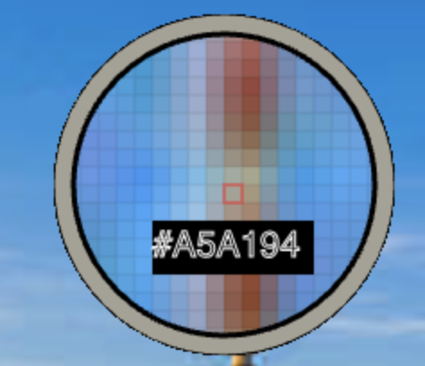

```shell
#npx create-react-app color-dropper --template typescript
npm install
npm start
```




- [x] reusable as package
- [x] work fine with large images(garbage collector/ Profiling w/ lighthouse/ over 10min tracking)
- [x] Image selection
- [ ] unit testing
- [ ] integration testing
- [ ] screenshot testing
- [ ] pupeteer
- [ ] linting/prettier
- [ ] husky for pre-commit
- [ ] CI/CD
- [ ] Only support canvas by default
- [ ] window.scrollY+getBoundingClientRect for inner layers
- [ ] nativeEvent(offsetX)
